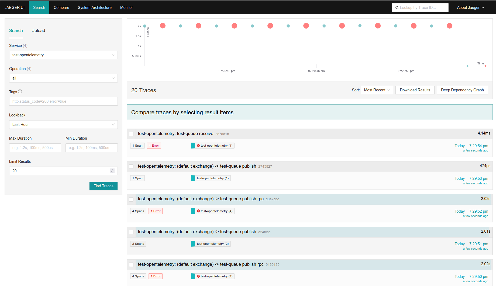
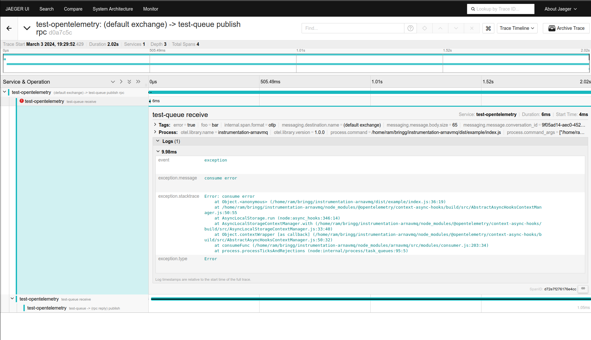
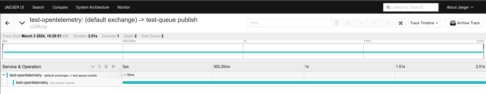

# Example Application

On this example, we demonstrate how to initialize and configure the automatic instrumentation for the `arnavmq` package.

On [bootstrap_opentelemetry.ts](bootstrap_opentelemetry.ts) file we initialize the opentelemetry sdk with basic configuration as describe in [official opentelemetry guide](https://opentelemetry.io/docs/languages/js/getting-started/nodejs/#setup).

On the [index.ts](index.ts) file we initialize the arnavmq instrumentation with an example consumer and producer app.

The app initializes a consumer, and periodically produces messages and sends RPC requests, sometimes resulting in errors, to simulate an application.

If you set the trace exporter in the bootstrap to `ConsoleSpanExporter` to see the resulting spans in the console, or use the `OTLPTraceExporter` to send them to a local server, like [jaeger](https://www.jaegertracing.io/docs/1.6/getting-started/#all-in-one-docker-image), and see them there.

## Example Spans

Following are example images of the spans created by this example, shown on jaeger.

### RPC Request

On an RPC request, the root publish span is only ended once a reply was received.

On the consumer, a child receive span is created which encapsulates the entire duration of the registered callback.

In case an error ocurred on the consumer and the message is rejected, it will be logged on the span. A new span would be created when the message is read again from the queue.

Once the callback is finished, a child span is created for the RPC reply publish from the consumer.

### Regular Produce

The root publish span is closed after the produce action is done, which should be very short. The consumer will create a child span starting on the message consumption and ending when the registered callback is finished.

